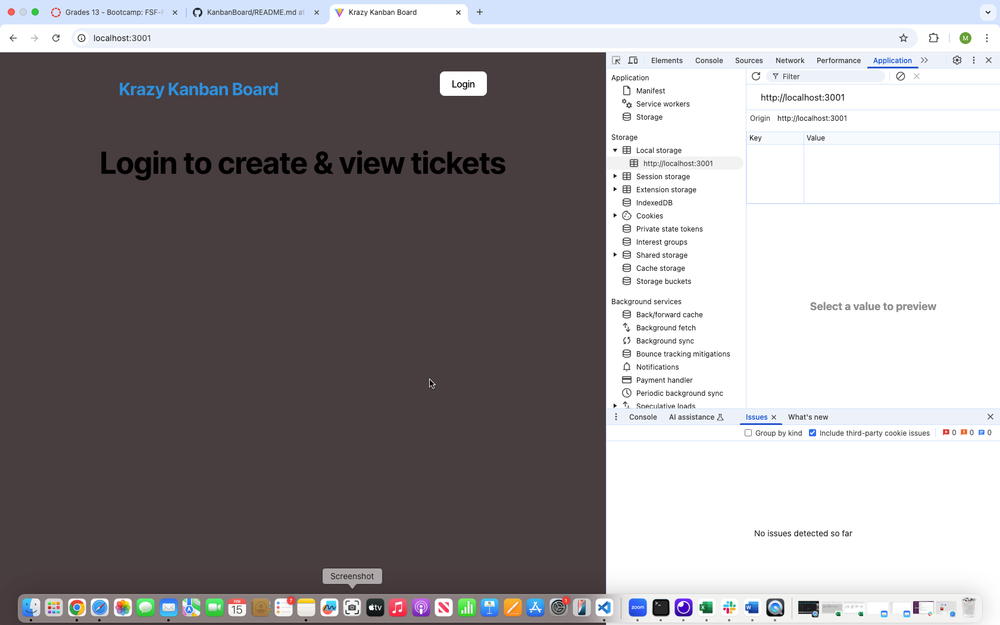
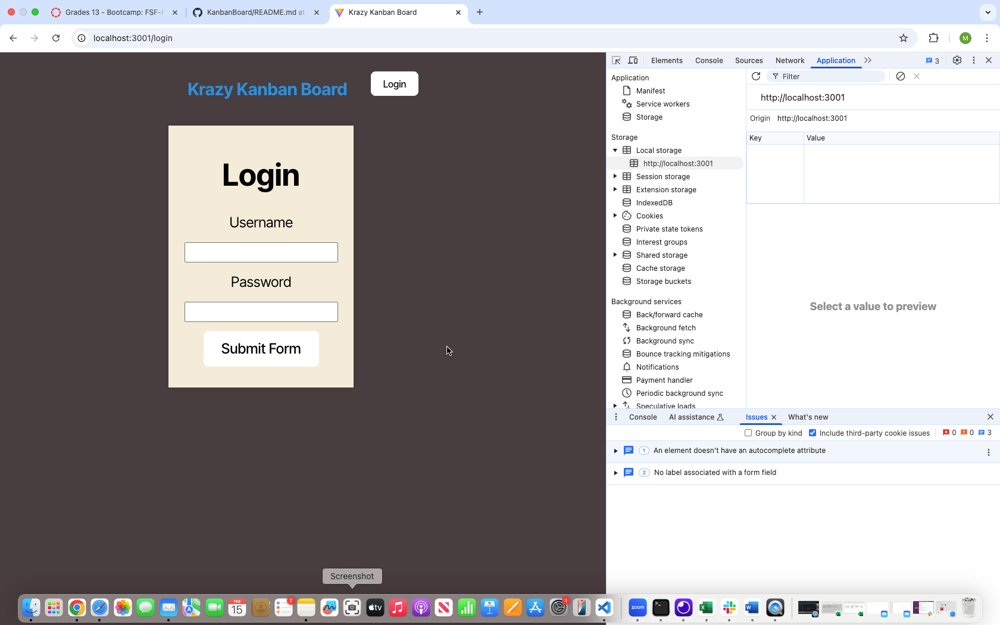
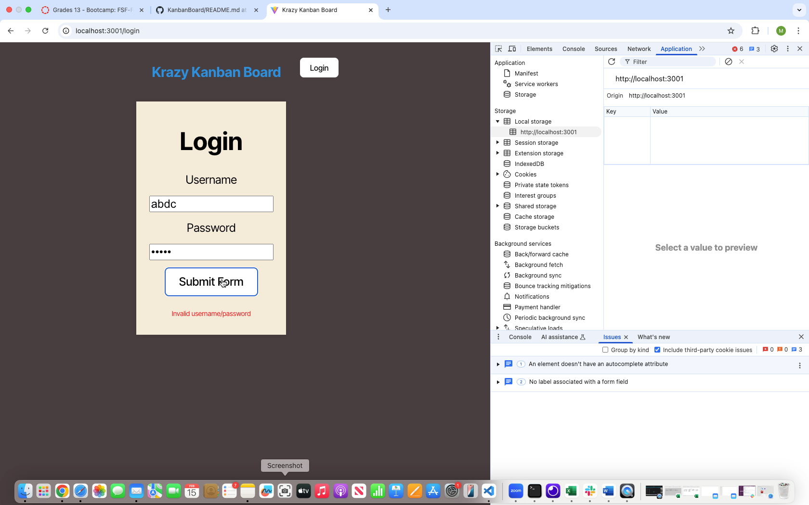
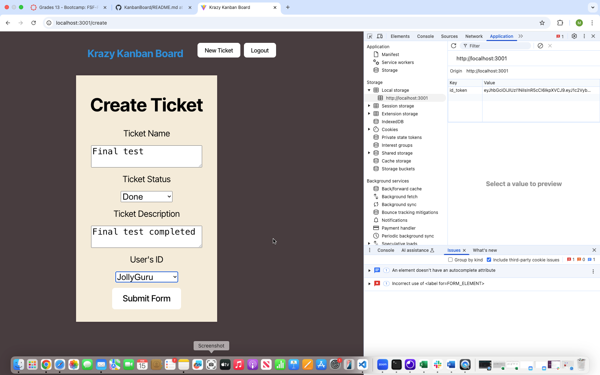
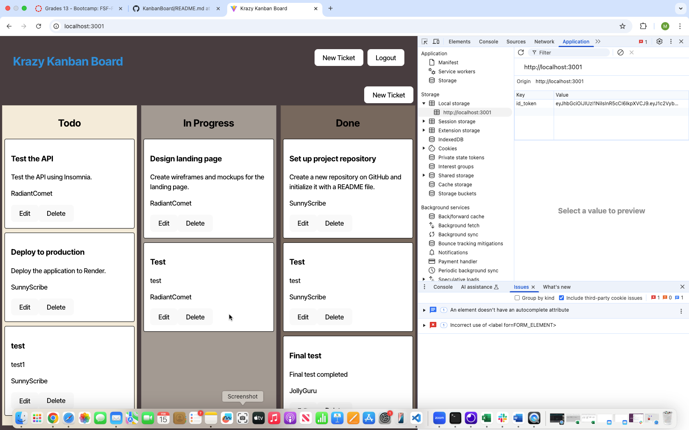

KoneTechI®  
  Feb, 2025
  
   
    
  # FULL STACK REACT - KANBAN-BOARD - Module 14

  ## Description
  This project is about adding authentication with JWT to an existing Kanban board application

  ## Table of Contents

  - [Installation](#installation)
  - [Usage](#usage)
  - [Credits]()
  - [Contributing](#contributing)
  - [Tests](#tests)
  - [License](#license)
  - [Questions](#questions)

## Installation
      - Create Repository in Git
      - Clone it to local machine
      - npm install
      - npm run build (on client)
      - npm run build (on server)
      - npm run seed ( for seed Data to get inserted into schema tables)
      - npm run start:dev or npm run start

## Usage
Once Application is started with npm run start, open the application in browser or open the render deployed application in browser and browse through the KanbanBoard as below
- Login with a valid username and password, which is available in system (For eg. username: JollyGuru password: password). Password is shared as this app is only for educational purpose
- Inspect the broser and check the token that is generated (as shown in screenshot).
- Add or remove task in Kanban board based on your preferences

Deployed link : - 

GitHub link :- https://github.com/muthukonar/KanbanBoard

Video link :- https://drive.google.com/file/d/1tYnzFaTkNu59nag35q1a7szQFTRpcWxr/view?usp=drive_link

Screenshots :

Landing and login page:

Error when tried to login without any username and/or password

Error when tried to login with invalid username and/or password

Logged in through valid username and password

Kanban Board, create/remove tickets

One logout or idle timeout(which is set to 1 minute) user will land back to login prompt page

## Credits
Instructor and TA's

## Contributing
Contact me for any improvements/feedback

 ## Tests
login , add new tickets, delete existing tickets, logout, check the token generated by inspecting the browser and wait for about i minute to check the inactive session timeout and the token getting removed from the local storage and user landing back to login page.

## License
This project is licensed under the MIT license.

## Questions
For any questions, please contact me at [pmkonar@gmail.com](mailto:pmkonar@gmail.com).
You can also find more of my work at [muthukonar](https://github.com/muthukonar).

'This document was last updated on Feb, 2025'

